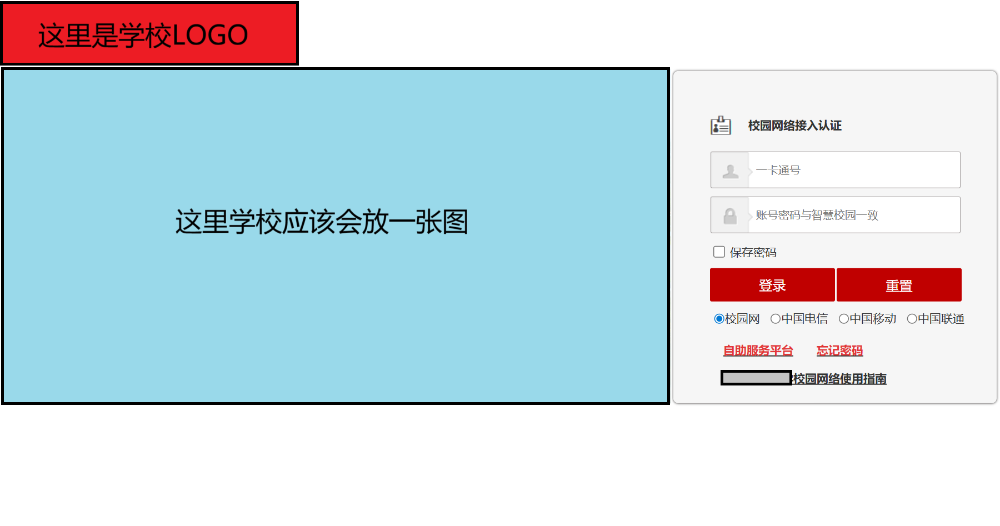

<h1 align=center><code>epauto</code></h1>

epauto是一个非常简单，针对下面界面网页登录的校园网的全自动登录工具



只需要在`config.toml`中输入校园网登陆网址、用户名和密码，然后运行epauto即可无需担心校园网的登录问题

虽然不敢保证所有类似的校园网能使用epauto，但根据身边统计学，至少存在其他高校使用该校园网系统，故可以暂时推断类似界面的校园网使用同一个系统

## 功能

- 基于配置的测试网址检测网络连通性；检测失败时自动执行校园网登录。
- 模拟网页登录流程，支持校园网、中国电信、中国联通和中国移动账号类型。
- 登录成功后通过WebSocket保持连接；连接超时、断开或发生异常时自动回到检测与登录流程。
- 登录失败时按可配置的递增间隔持续重试，避免频繁请求校园网服务。
- 支持自定义登录地址、账号密码、连通性检测地址、WebSocket 保活参数和配置文件路径，适合在路由器或常驻设备上长期运行。

## 如何使用

```
$ epauto --help

Usage: epauto [OPTIONS]

Options:
  -c, --config PATH  Path to configuration file.
  -V, --version      Print epauto version.
  --help             Show this message and exit.
```

要使用epauto，需要提供校园网的登录网址、用户名和密码来让epauto通过模拟浏览器网页登陆的方式来登录校园网

epauto使用[TOML](https://toml.io/cn/v1.0.0)作为配置文件，默认读取当前目录下的`config.toml`，你可以使用`--config PATH`参数来自定义配置文件的地址

> epauto使用标准库`tomllib`解析TOML文件，`tomllib`只能解析TOML而无法写入，故epauto无法创建默认配置；epauto仓库提供了一份默认的`config.toml`，请根据该配置文件自行更改

## 安装

### 准备工作

需要安装下面的依赖:

- [Python](https://www.python.org/downloads/) 3.11或更新
- (可选) [uv](https://docs.astral.sh/uv/) 0.9或更新
- (可选) [Docker](https://www.docker.com/) 28.0或更新
- (可选) [Podman](https://podman.io/) 5.0或更新

### ~~方法1: 使用pip安装~~

> 暂未发布

### 方法2: 使用`git clone`

在安装uv后，执行:

`$ git clone https://github.com/rintim/epauto.git`

然后进入epauto的目录，修改`config.toml`的配置，然后执行:

```
$ uv sync
$ ./.venv/bin/epauto
```
### 方法3: 使用Docker/Podman

要使用该方法，需要安装Docker和Podman中的任何一个来构建容器

请执行:

```
-- 克隆epauto仓库
$ git clone https://github.com/rintim/epauto.git

-- 进入epauto目录
$ cd epauto

-- 开始打包
$ docker/podman build . -t "epauto:0.4.1"

-- 等待打包完后运行
$ docker/podman run -it -v $config.toml:/app/config.toml "epauto:0.4.1"
```

## 版权

本项目基于 [MIT license](LICENSE) 许可发布。
